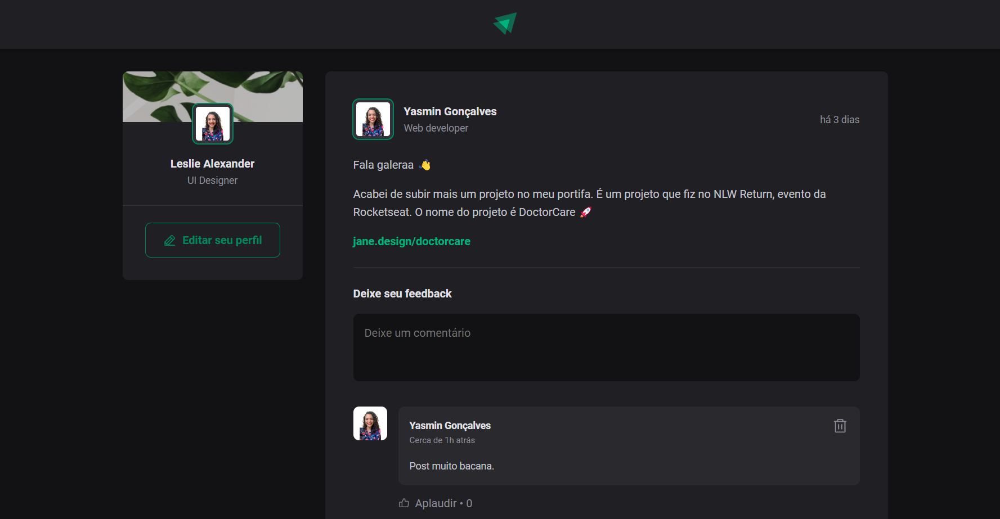

# fundamentos-react-ignite

Projeto desenvolvido durante o módulo 1 do [Ignite](https://lp.rocketseat.com.br/ignite?&).

## Ferramentas de construção

- Construído com [Vite](https://vitejs.dev/);
- CSS modules;
- Biblioteca de ícones: [Phosphor Icons](https://phosphoricons.com/).

## Aprendizado

Com a construção do projeto foi possível entender melhor o contexto de utilização do React e como se dá a lógica de criação de páginas web com o conceito de SPA.
   
Foram apresentados os conceitos de componentes e propriedades. 
 
Componentes podem ser entendidos como uma forma de desacoplar uma parcela da interface da aplicação de modo a deixá-la repetível e/ou facilitar a manutenção. Sua criação fica evidente em dois momentos: 
 
    1. quando algo se repete na tela muitas vezes;
     
    2. abstrair parte de um componente maior.
     
Por sua vez, as propriedades são informações que podemos passar aos componentes, fazendo uma analogia ao HTML, as propriedades são atributos dos componentes React.

## Tela da aplicação

## Deploy da aplicação

[Ignite feed](https://fundamentos-react-ignite.vercel.app/)

 

Caso prefira abrir a aplicação no localhost basta digitar o comando `npm run dev`
